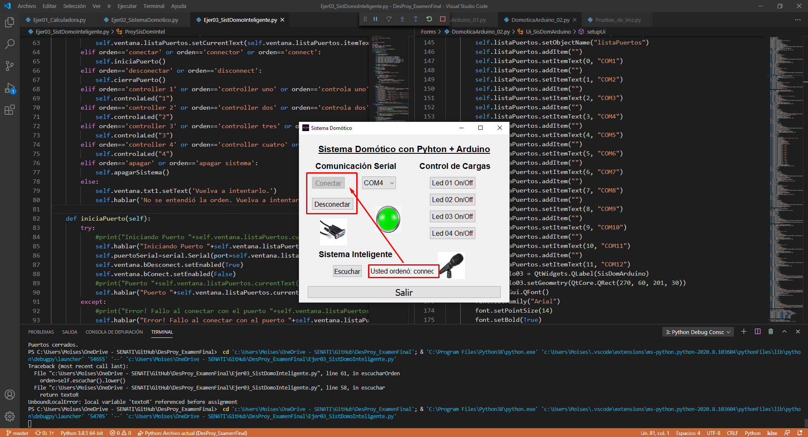

# Examen Final del curso Desarrollo de Proyectos
El examen final del curso constó de seis ejercicios y son los siguientes:

### Ejercicio 01
Realice una Calculadora Básica con en QtDesigner y Python:

### Ejercicio 02
Realice una Interface grafica en QtDesigner y Python para controlar cargas conectadas a un microcontrolador ARDUINO:

_Interfaz Gráfica_

_Esquema de simulación con Arduino_

### Ejercicio 03
A la aplicación anterior, incorporar la librería de conversión de texto a voz `pyttsx`. También la librería de reconocimiento de voz `speech_recognition` u otra, para realizar un sistema domótico de tal forma que obedezca comandos de voz y mencione verbalmente la acción a realizar:

### Ejercicio 04
Graficar una o más señales analógicas del Arduino en una GUI (Uso de QwtPlot en QtDesigner).

### Ejercicio 05
Diseñar una tarjeta de adquisición de datos con Arduino y Python, con una GUI, que permita controlar salidas digitales, entradas digitales, entradas analógicas, salidas analógicas, etc.

### Ejercicio 06
Aplicación Libre.

---
## Soluciones
Aquí solo mostraré capturas de como los programas ya está funcionando y detrás se apareciará un poco el código realizado. Además...
### Instrucciones de uso de cada aplicativo
Es probable que también quieras probar mis aplicaciones, pero es necesario dar ciertas indicaciones para que puedas probarlas, ya que no están libres de errores, lo cual es entendible ya que solo tuve 3 días para hacerlas y usando una librería que recién había aprendido de una semana. xD (Y eso que las de reconocimiento de voz las aprendí en el momento. :laughing:)

Así que más o menos, después de la "breve descripción" de cada solución se hablaré un poco a detalle de como usarlo. Por último, mencionar que el código de los programas no han sido comentados debido al corto plazo de entrega.

**Aviso: Se usó el QtDesigner solo para el diseño de las ventanas, sin funcionalidad alguna.**

### Solución 01
Toda la lógica de funcionamiento fue tipeado a pura lógica del programador, o sea yo ;3, y a pensado vagamente sin considerar todas las posibles "trabas" que pudieran haber para que el programa no funcionase, es por ello, que por ejemplo, los paréntesis no tengan utilidad y que solo se puedan hacer operaciones de dos en dos, como `27.345+12.65` o directamente solo elevar a la potencia. Pero recuerda: **No usar los paréntesis, porque no tienen lógica de funcionamiento. xD**

También hay algunas operaciones en las que no se puede borrar un dígito o varios del resultado, como después de calcular la raíz cuadrada o elevar al cuadrado, lo que si puedes hacer es seguir haciendo operaciones después de esos cálculos pero nada más. Cualquier otra cosa, puedes seguir probando y ver los errores que da, o recibar el código y si gustas, depurarlo por tu cuenta. :smile:

### Solución 02
El objetivo: "Controlar leds conectados al arduino por medio del puerto serial". Y se hizo, con este programa elijes el puerto con el cual está vinculado al Arduino y así mandar las señales de control por medio de la terminal.

Aquí se ve el Aplicativo con su código detrás.

Y aquí ya se ve el esquema usado para la prueba del programa.

### Solución 03
Lo mismo que la anterior solución pero ahora las señales se podrán enviar por medio de comandos de voz, y casi cada acción ejecutada será dicha por el propio programa.

Aplicativo con su código detrás.

Y aquí el resultado con la simulación de Arduino.

Cada acción es individual, no hay acciones mixtas, por lo que cada acción a realizar será comandado después de presionar el botón "Escuchar". **Repito, la orden dada por voz es explícitamente una única acción a realizar.**

Para el control de encendido o apagado de cada led se menciona la palabra 'control' o 'verde' seguido del número de led a controlar, los comandos exactos son:

|controller 1|controller uno|controla uno|controla 1|controlar 1|controlla uno|controlla 1|verde uno|verde 1|
|------------|--------------|------------|----------|-----------|-------------|-----------|---------|-------|

**Recordar que el número depende del led que desee controlar.**
_Notita: Se escogió el comando 'verde' por el color del led usado en Proteus._

El resto de comandos hacen referencia al número de puerto (el cuál por ahora solo es para el 4), a la conexión, desconexión y apagdo del sistema, como se ve a continuación:

| **Puerto #** |**Conectar**|**Desconectar**|  **Comando sobre el sistema**  |
|--------------|------------|---------------|--------------------------------|
|puerto 4      |conectar    |desconectar    |apagar                          |
|puerto cuatro |connector   |disconnect     |apagar sistema                  |
|              |connect     |               |                                |

En el caso de no entender la orden, el propio sistema dirá: "No se entendió la orden. Vuelva a intentarlo." y después de eso, hacer clic al botón "Escuchar" para intentarlo de nuevo.

### Solución 04 y Solución 05
No desarrollados... Debido al corto lapso de tiempo.
#### Soluciones faltantes?! Si, hay ejercicios que no resolví pero probablemente sean realizados en un futuro como proyectos separados.

### Soluciones 06
Para el caso del sexto ejercicio, ya que era "Aplicativo Libre", **se presentaron dos soluciones para compensar un poco** la falta de las anteriores dos soluciones.
**El primero,** es un reproductor multimedia bastante funcional con el cual se han probado los siguientes formatos:

|**Video**|**Audio**|**Imagen**|
|---------|---------|----------|
|.mp4     |.mp3     |.jpg      |
|.avi     |.wav     |.png      |
|.mkv     |         |.gif      |
|.wmv     |         |.ico      |

Este aplicativo es fácil de usar, solo le das a "Buscar...", abres el archivo que desees y que sea compatible con los formatos antes mencionados, y le das al play, para que se pueda visualizar si es el caso de una imagen o vídeo, o si es un audio, lo reproducirá. No hay un control de volumen pero eso se puede implementar más adelante. :3

**El segundo,** es una calculadora o convertidora de grados de Temperatura, con el cual se pueden hacer hasta 9 conversiones entre grados Celcius, Kelvin, Fahrenheit y Rankine.

Como se aprecia en la imagen, básicamente con la lista desplegable elijes la conversión y en la casilla de la izquierda escribes lo que quieres convertir; el resultado se podrá visualizar en la casilla derecha después de haber presionado el botón "Calcular". También incluye reproducción de texto a voz, por lo que el resultado será dictado al finalizar la conversión.

---
## Ejecutables!!
Por último, cabe mencionar, que en la carpeta compartida "[Ejecutables](https://drive.google.com/drive/folders/15mvcbARFIPr2oyRCyh02q8u0NrN_ReYq?usp=sharing)", encontrarás los programas en .exe para que directamente los pruebes sin necesidad de instalar python o librerías, sin embargo, no están todos los programas, esto es debido a que en algunos se usaron librerías de reconocimiento de voz y es probable de que estas no se puedan comprimir a un .exe, tampoco le he buscado alguna solución a este problema ya que estaba a contrareloj con el examen.

Por último, cabe decir que es muy probable que estos archivos ya no los modifique en un futuro, pero eso no quita el hecho de que no haga más programas similares, y mucho mejor trabajados. :smile:
